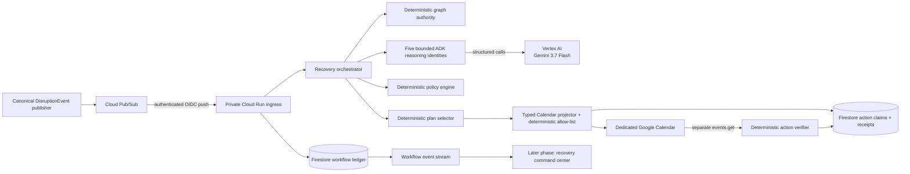
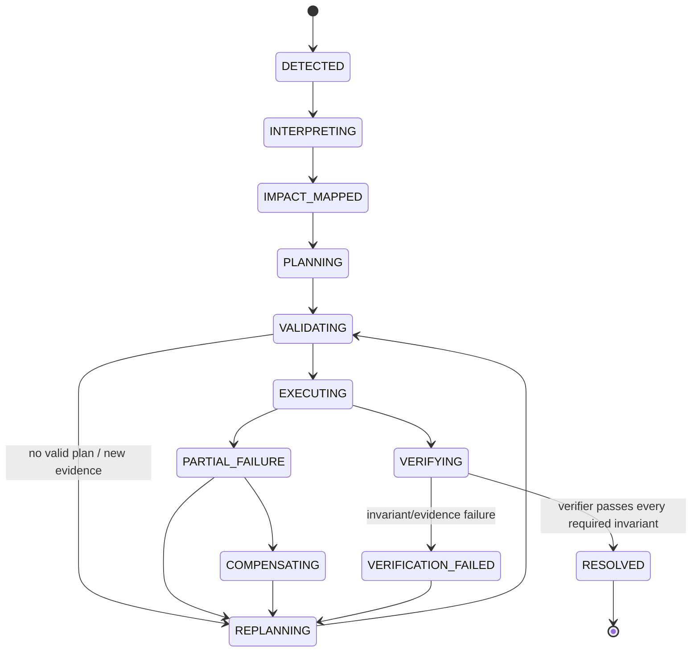

# Architecture

## Architectural stance

The domain core is framework-independent. Google ADK orchestrates bounded reasoning, while
Firestore and deterministic services remain authoritative. Gmail, Calendar, and GitHub are
narrow external adapters; model reasoning cannot call them directly or establish objective truth.

## System context

## Boundaries

| Boundary | Owns | Must not own |
|---|---|---|
| Domain | Objective graph, policies, invariants, lifecycle, action/receipt semantics | SDKs, HTTP, database clients, prompts |
| Application | Use-case coordination, ports, stable selection | External implementation details |
| Reasoning/ADK | Typed event interpretation, candidate futures, risk critique, explanations | Hard policy decisions, lifecycle truth, resolution |
| Adapters | Gmail/GitHub/Calendar/Firestore/API mechanics | Business policy or objective truth |
| Verifier | Fresh evidence reads and deterministic invariant evaluation | Reuse of write responses as proof |

## Agent roles

1. **Disruption Interpreter** — extracts typed, grounded facts from untrusted event evidence.
2. **Impact Analyst** — proposes candidate threatened nodes; deterministic graph code remains final.
3. **Recovery Planner** — proposes typed counterfactual recovery futures for initial or revised context.
4. **Risk Critic** — attacks candidate assumptions, evidence, and operational risks without approval authority.
5. **Recovery Analyst** — synthesizes typed failed-verification context before the planner runs again.

See [P2C agent boundaries](p2c-agent-boundaries.md) for exact schemas, identities, calls, denied
authority, and the complete pre-refactor invocation audit.

## Deterministic services

- Operational Graph Service: accepted structured edges and reverse blast-radius traversal.
- Policy Engine: workload, skills, protected deadlines, permissions, and blocking unknowns.
- Plan Selector: stable ordering over valid candidates.
- Workflow Ledger: incidents, transitions, attempts, event deduplication, leases/checkpoints.
- Action Router: adapter selection and stable idempotency contract.
- Objective Verifier: evidence freshness, required checks, and invariant aggregation.

## State ownership

Firestore is the authoritative durable store for incidents, accepted graph versions, candidates, policy decisions, selected plans, action intentions, receipts, verification results, and transition history. ADK session/events are reasoning artifacts and correlation evidence, not the workflow ledger.

Writes that claim a new action intention or consume an event use a Firestore transaction. A stable key is derived from incident, plan revision, logical action, target, and intended state. Duplicate delivery returns the existing intention/receipt.

## Event flow and reliability

1. Authenticate Pub/Sub push or verify GitHub signature.
2. Parse the transport envelope and derive a source event identity.
3. Transactionally claim/deduplicate the event before acknowledgement.
4. Persist the typed disruption and traverse the accepted graph deterministically.
5. Generate typed candidates and critique each with separate ADK reasoning boundaries.
6. Validate hard policy and blocking unknowns, then select stably in deterministic code.
7. Persist the selected plan at `PLAN_SELECTED`.
8. Derive and authorize one reversible coordination block only when the selected plan coordinates
   multiple real workstreams and assignees.
9. Transactionally claim the intent, preflight its deterministic external event ID, insert only
   when absent, and persist `WRITE_ACKNOWLEDGED`.
10. Issue a new Calendar `events.get`, normalize meaningful fields, persist `VERIFIED` or
    `VERIFICATION_FAILED`, and stop the incident in `VERIFYING`.

Retries use bounded exponential backoff with jitter at adapter boundaries. Poison events move to a dead-letter path with an explicit incident error rather than silent loss. Gmail history synchronization runs periodically because notifications can be delayed or dropped.

## Incident lifecycle

## Trust and authority rules

- Model output is untrusted typed input until schema and policy validation pass.
- Prompt-injected email text cannot alter policies or tool permissions.
- OAuth scopes and service accounts are adapter-specific and least-privilege.
- Secrets belong in Secret Manager or local ignored environment files, never Git.
- External write success is a receipt, not proof of final state.
- Emulated adapters produce `EMULATED` receipts, which objective verification rejects as external proof.
- Product surfaces show evidence and concise decision summaries, never hidden chain-of-thought.

## P1B boundary

P1B extends the frozen Pub/Sub → Cloud Run → Firestore → ADK/Gemini path through one real
Calendar action and an independently verified action receipt. The caller-supplied event ID is
`p1b` plus the stable SHA-256 idempotency key, using only Calendar-supported base32hex
characters. A retry first discovers that object, so a process death between insert and receipt
persistence cannot create another event. Calendar access uses a short-lived
`https://www.googleapis.com/auth/calendar.events` token for the runtime service account, which
has writer access only to the dedicated owner-created demo calendar. No refresh token, client
secret, domain-wide delegation, primary-calendar access, or attendee notification exists.

Objective verification and `RESOLVED`, plus Gmail, GitHub, compensation execution,
failure-triggered replanning, product authentication, and UI remain later work requiring explicit
approval.
