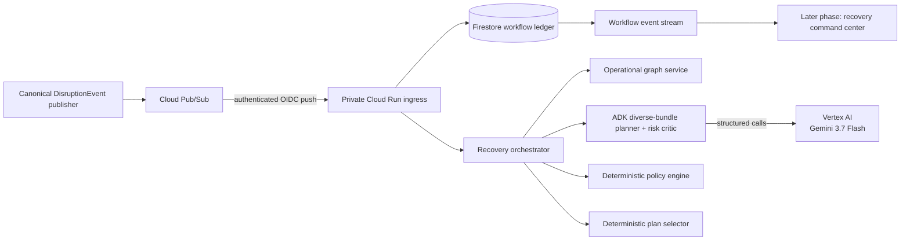
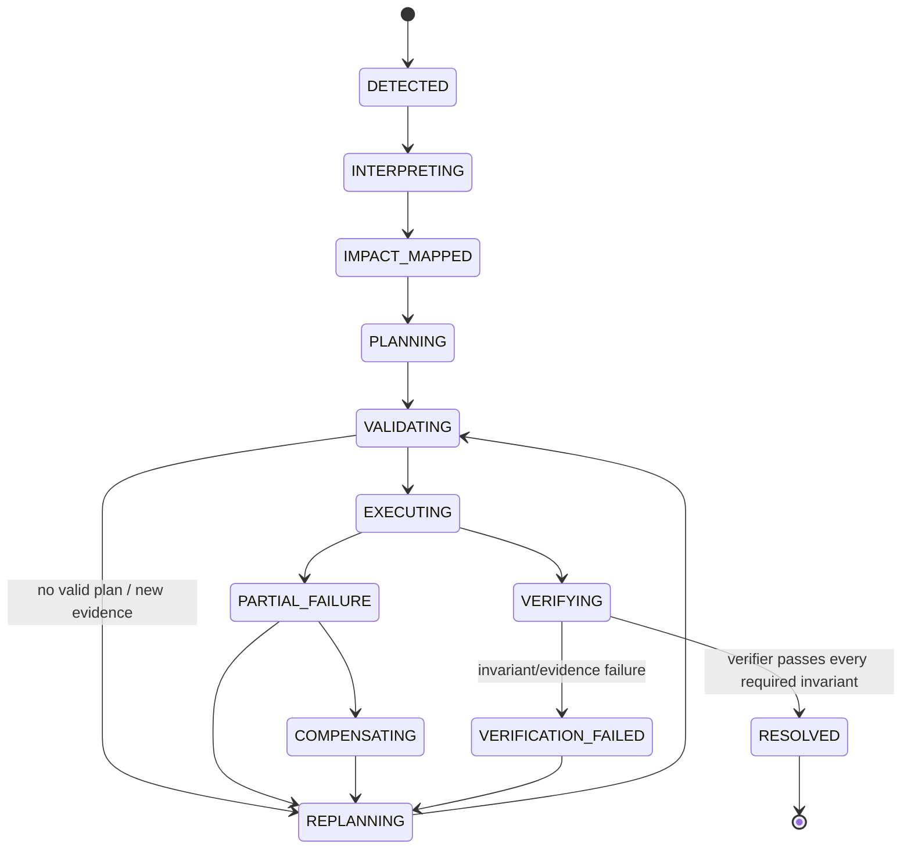

# Architecture

## Architectural stance

The domain core is framework-independent. Google ADK orchestrates bounded reasoning in P1A, while Firestore and deterministic services remain authoritative. Gmail, GitHub, Calendar, authentication, and UI remain outside this phase.

## System context

## Boundaries

| Boundary | Owns | Must not own |
|---|---|---|
| Domain | Objective graph, policies, invariants, lifecycle, action/receipt semantics | SDKs, HTTP, database clients, prompts |
| Application | Use-case coordination, ports, stable selection | External implementation details |
| Reasoning/ADK | Typed event interpretation, candidate futures, risk critique, explanations | Hard policy decisions, lifecycle truth, resolution |
| Adapters | Gmail/GitHub/Calendar/Firestore/API mechanics | Business policy or objective truth |
| Verifier | Fresh evidence reads and deterministic invariant evaluation | Reuse of write responses as proof |

## Agent roles

1. **Event Interpreter** — maps unstructured evidence to a typed disruption with evidence references and unknowns.
2. **Recovery Planner** — one diverse-bundle workflow returns exactly three schema-valid, materially different deadline/risk/resource futures.
3. **Risk Critic** — identifies contradictions, assumptions, missing evidence, and failure modes. It cannot approve a plan.

More agents require evaluation evidence or a distinct context/tool/security boundary.

## Deterministic services

- Operational Graph Service: accepted structured edges and reverse blast-radius traversal.
- Policy Engine: workload, skills, protected deadlines, permissions, and blocking unknowns.
- Plan Selector: stable ordering over valid candidates.
- Workflow Ledger: incidents, transitions, attempts, event deduplication, leases/checkpoints.
- Action Router: adapter selection and stable idempotency contract.
- Objective Verifier: evidence freshness, required checks, and invariant aggregation.

## State ownership

Firestore is the authoritative durable store for incidents, accepted graph versions, candidates, policy decisions, selected plans, action intentions, receipts, verification results, and transition history. ADK session/events are reasoning artifacts and correlation evidence, not the workflow ledger.

Writes that claim a new action intention or consume an event use a Firestore transaction. A stable key is derived from incident, plan revision, logical action, target, and intended state. Duplicate delivery returns the existing intention/receipt.

## Event flow and reliability

1. Authenticate Pub/Sub push or verify GitHub signature.
2. Parse the transport envelope and derive a source event identity.
3. Transactionally claim/deduplicate the event before acknowledgement.
4. Persist the typed disruption and traverse the accepted graph deterministically.
5. Generate exactly three typed candidates and critique each with a separate ADK workflow.
6. Validate hard policy and blocking unknowns, then select stably in deterministic code.
7. Persist the selected plan and stop. P1A performs no external action and cannot resolve the incident.

Retries use bounded exponential backoff with jitter at adapter boundaries. Poison events move to a dead-letter path with an explicit incident error rather than silent loss. Gmail history synchronization runs periodically because notifications can be delayed or dropped.

## Incident lifecycle

## Trust and authority rules

- Model output is untrusted typed input until schema and policy validation pass.
- Prompt-injected email text cannot alter policies or tool permissions.
- OAuth scopes and service accounts are adapter-specific and least-privilege.
- Secrets belong in Secret Manager or local ignored environment files, never Git.
- External write success is a receipt, not proof of final state.
- Emulated adapters produce `EMULATED` receipts, which objective verification rejects as external proof.
- Product surfaces show evidence and concise decision summaries, never hidden chain-of-thought.

## P1A versus planned components

P1A implements the Pub/Sub → Cloud Run → Firestore spine and real structured ADK/Gemini planning through `PLAN_SELECTED`. External adapters, action dispatch, independent read-back, verification, resolution, authentication, and UI remain planned and require a later explicit approval.
