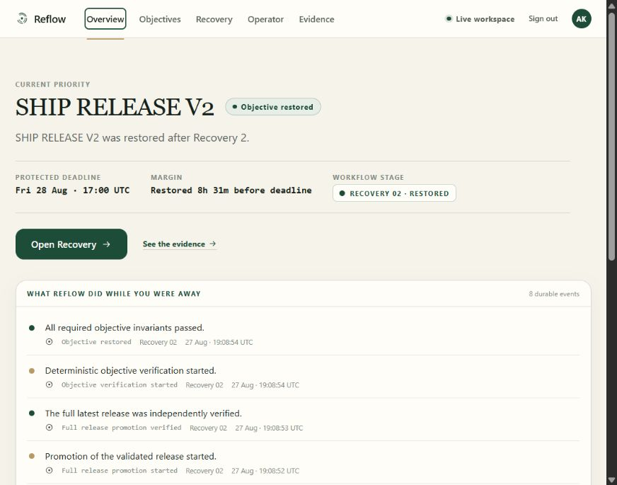
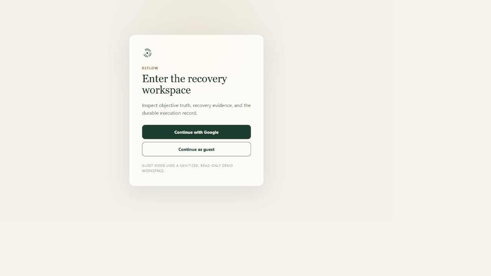
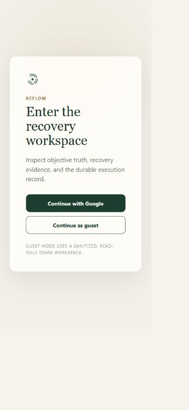

# P2D live UI proof

Proof date: 2026-08-28. Firebase/GCP project: `project-f334c42b-7a03-4194-932`; region: `us-central1`.

## Immutable deployment

- Firebase Hosting site: `reflow-objective-recovery`; live URL: <https://reflow-objective-recovery.web.app>.
- Hosting release: `1787904910979000`; version `def49e51fcae31fa`; SPA/deep links return `200` with `no-store` HTML.
- Cloud Build: `98d2b5c1-52f3-49e4-a75e-4fe2096bb756` (`SUCCESS`).
- BFF revision: `reflow-web-bff-00003-wxf`, 100% traffic.
- BFF image: `us-central1-docker.pkg.dev/project-f334c42b-7a03-4194-932/objective-recovery/reflow-web-bff@sha256:0000be34643596286097672a672c199355c2fd7816bba50064926d4e995ae8aa`.
- BFF runtime identity: dedicated `reflow-web-bff@project-f334c42b-7a03-4194-932.iam.gserviceaccount.com`.
- Private backend remains `objective-recovery-00021-gxq` on immutable image `sha256:0785ae26839937416a5f2fa6d3b3ce7ad1cfab037cbd85891a4a5a1b02f861d7`.

The private backend IAM policy contains only four service-account invokers: the Gmail job, Gmail push, Pub/Sub, and dedicated BFF identities. It contains no `allUsers`. Direct anonymous presentation access returned `403`; the public BFF intentionally has `allUsers` invoker because Firebase/BFF application authentication is enforced inside the service.

Firebase Authentication has anonymous login enabled, Google `google.com` enabled, and both Hosting domains authorized. Google product login completed in the deployed browser, established a 55-minute secure session, reached `Live workspace`, and produced `200` in both BFF and private-backend Cloud Run logs for `/api/v1/ui/overview`.

## Product smoke

- Landing `Live demo` has target `/app`; a fresh shell navigated client-side to `/app/overview` and rendered the live dashboard.
- Overview rendered `SHIP RELEASE V2`, `Objective restored`, Recovery 02 restored, eight durable events, preserved deadline, and restored margin.
- Objectives rendered Release V2 as `Restored`, stage `RECOVERY 02 · RESTORED`, with the protected deadline.
- Recovery rendered revision 16, R1 Detect/Impact/Plan/Act/Verify `FAILED`, and R2 Replan/Plan/Act/Verify/Restored. The R1 Verify lens visibly showed two verified action receipts while `release-validation-green` expected `true` and observed `false`; therefore the objective was not restored. R2 showed Candidate B, successful CI, full/latest promotion, and all six invariants passed.
- Evidence rendered 28 durable events and seven exact proof records with normalized Gmail, Google Calendar, GitHub Actions/GitHub, and Reflow deterministic verifier authorities. Exact Calendar receipt, GitHub run IDs, candidate SHAs, promotion ID, and verification joins resolved.
- Operator rendered `READ-ONLY`/`Inspect` with no SIMULATE, DIRECT, or ACT control.
- Programmatic guest smoke returned `200`/`X-Reflow-Workspace: guest` for all six allowed read resources, returned `404` for an arbitrary incident, and made no private-backend call.
- Live sign-out returned `204`; the next session read returned `401`. A valid session changed from `200` to `401` after Firebase revocation. Invalid sessions returned `401`; bad session origins returned `403`.
- Direct BFF ETag proof returned `200` with `W/"51"`, then `304` for `If-None-Match`. The data provider also has a tested 304 cache path.

At 390×844 the auth surface had `scrollWidth == viewportWidth == 390`. Direct `/app` asset inventory contained the app/auth/route chunks and no Three.js, GSAP, Lenis, or GLB asset. Browser console was clean on the fresh final live shell.

## Contract, immutability, and gates

- Exported deployed OpenAPI and `docs/ui-openapi.json` are structurally equal. Generated TypeScript and standalone validators are current.
- Canonical incident: `incident-0fc3af5b0bd1ad847aea`, revision 16. Its recovery SHA-256 remained `0147818BDC091808581B288BD77231B96A083D02259419937634E483ECBE5167`; no duplicate recovery was created.
- Backend/BFF: 193 passed, 1 skipped live Firestore test, 97.77% coverage; focused P2D suite 26 passed. Ruff check/format passed. Configured strict mypy (`src tests`) passed across 37 files.
- Frontend: 44 tests passed; typecheck, lint, Prettier check, generated-contract checks, and production build passed.
- Refined secret scans found zero secret-shaped source files, zero secret-shaped browser-bundle files, and zero private backend/service-account identifiers in the browser bundle.
- Recovery-semantic files changed from the pre-P2D authority: none.

Known debt is unchanged: the explicitly wider, out-of-config `objective_recovery_agent` mypy run reports the documented P2C typing debt. Firebase Hosting revalidation returned a full `200` while direct BFF conditional access returned `304`; correctness and ETag propagation are preserved, but proxy-level 304 optimization remains a hosting behavior. A browser tab that cached the pre-`no-store` shell needs one hard refresh; all newly served SPA HTML is now `no-store`.
