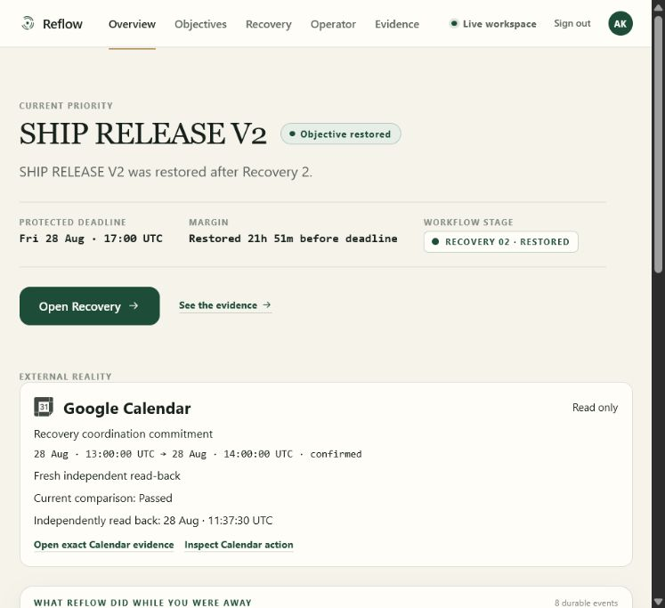
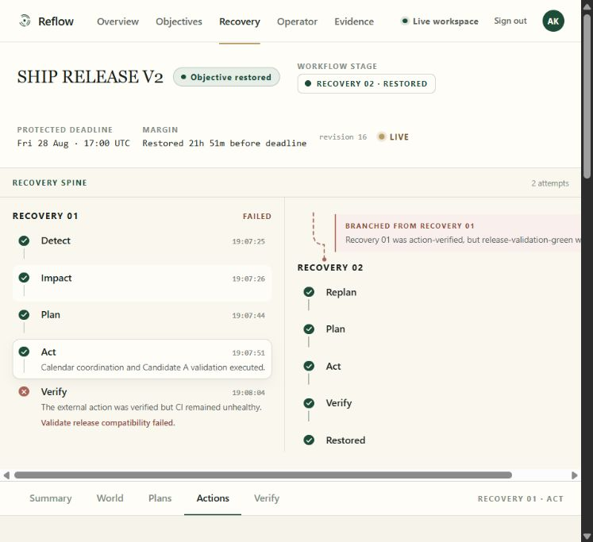
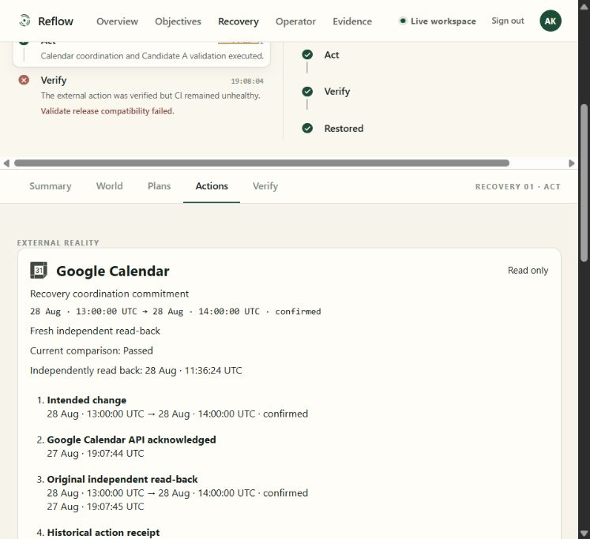
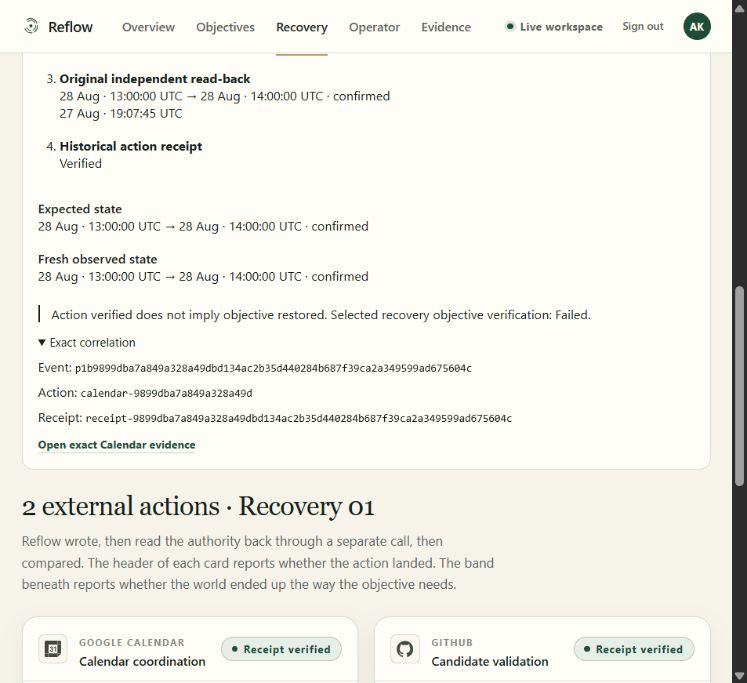
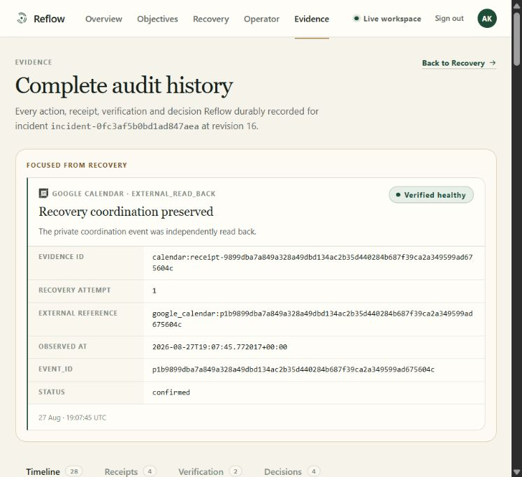
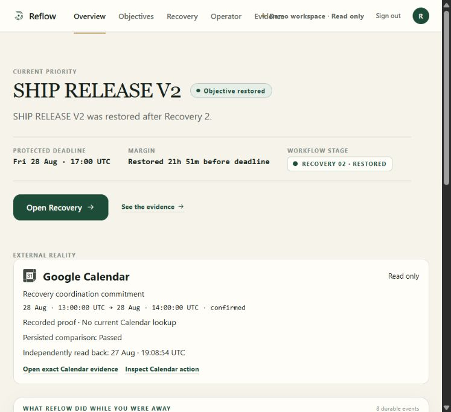

# P2E-A — Live Calendar dashboard qualification

Qualification date: 2026-08-28. Source: `ec9004ba5ce0befbfc220d3865a521083396b644`.

**LIVE CALENDAR DASHBOARD GO.**

Implementation, local gates, deployment, real fresh Calendar GET, exact evidence join,
guest API isolation, and incident immutability passed. After the user completed genuine
Google sign-in, the authenticated Live Overview, Recovery 01 Calendar ladder, and exact
Evidence record were verified and captured on 2026-08-28 around 11:35–11:38 UTC.
Both BFF and private backend returned `200` for the live UI requests. No Google identity
was fabricated and no authentication/IAM change was made to bypass the earlier browser
sign-in delay. No source or deployment change was necessary to complete this final gate.

## A. Existing Calendar implementation audited

See [the pre-implementation authority audit](p2e-a-calendar-audit.md) for all ten audit
items. The existing gateway, execution service, action claim/receipt, known event,
normalizer, verifier and later closure read-back are the authorities. No parallel
receipt or Calendar product was introduced.

Repository handoff: checkout already included both `18313e6` and `24a4219`, with HEAD
exactly at `24a4219` before this work. The incoming marketing diff was inspected.
There is no configured Git remote, so `fetch origin`/pull could not succeed; the older
local `main` was not substituted for the approved checkout. Frozen marketing source,
styles, 3D, and its accepted visual debt were not modified.

## B–F. Reused read-back and freshness

- **B:** Reused `GoogleCalendarGateway.get_event`, `normalize_calendar_event`, and
  `verification_differences`, with the existing dedicated calendar and service identity.
  No execution service is instantiated by dashboard reads.
- **C:** Original historical receipt remains `VERIFIED`, acknowledged at
  `2026-08-27T19:07:44.825660+00:00`, independently read at
  `2026-08-27T19:07:45.772017+00:00`.
- **D:** Latest persisted independent read-back comes from existing
  `plan_revisions/0002.calendar_closure_evidence`, observed at
  `2026-08-27T19:08:54.311870+00:00`. It is explicitly `PERSISTED_READBACK`.
- **E:** A fresh read-through is implemented: one known-event GET, a three-second
  gateway request timeout and a six-second presentation wait bound. No executor retry,
  receipt write, incident update or action rerun is involved. The wait bounds the
  response; an already-running worker may finish its GET after a timeout.
- **F:** The existing gateway already supports this safely without a new OAuth flow.
  Production returned `READ_BACK` / `FRESH_READ` / `PASSED` at
  `2026-08-28T11:15:06.832425+00:00` and again at
  `2026-08-28T11:15:51.573540+00:00`. Logged request latencies were 0.834 and 0.530 seconds.
  Both used existing operator authorization against the private service, not a
  fabricated Firebase session. A local impersonation refresh limitation did not
  reproduce under the deployed runtime identity.

## G–I. Contract, fields and sanitization

- **G:** Additive typed GET
  `/api/v1/ui/recoveries/{incident_id}/external-reality`, served privately and through
  the existing authenticated BFF. Python schemas, OpenAPI, TypeScript types and runtime
  validators agree. Deployed OpenAPI is structurally identical to the source export.
  All previous schemas and paths remain structurally unchanged. The new resource is
  `Cache-Control: no-store`, has no ETag, and does not accept conditional stale truth.
- **H:** Authority/resource type, safe product label, known event/action/receipt/evidence
  IDs, recovery attempt, expected and observed start/end/status, original acknowledgement,
  historical receipt status, observation timestamp, freshness and fresh lookup status.
  Current expected and observed state: `2026-08-28T13:00:00+00:00` to
  `2026-08-28T14:00:00+00:00`, `confirmed`. The resource list can be extended later;
  no GitHub presentation was added.
- **I:** Explicit allowlisting excludes calendar/account IDs, emails, attendees,
  descriptions, meeting URLs, arbitrary external titles, private extended properties,
  tokens, grants and credentials. The displayed title is a fixed product label, not
  a fabricated external event field. Existing recognizable Calendar identity is reused.

## J–L. UI and exact evidence

- **J:** Overview gains a compact, read-only Calendar proof below the existing outcome.
  It displays actual time/status, current or persisted comparison, actual observation
  time and links to Recovery and exact Evidence. No grid or broad redesign.
- **K:** Recovery Summary/Actions/Verify gains the intended → API acknowledged → original
  independent read-back → historical receipt ladder, expected/latest observed comparison,
  and a separate selected-recovery objective verification result. Current Calendar
  comparison never replaces historical receipt status or objective verification.
  Deployed authority still reports Recovery 01 `FAILED`, Recovery 02 `PASSED`.
- **L:** Existing exact join:
  `calendar:receipt-9899dba7a849a328a49dbd134ac2b35d440284b687f39ca2a349599ad675604c`.
  The deployed Evidence response contains exactly one matching record. The action ID is
  `calendar-9899dba7a849a328a49d`; the event ID is
  `p1b9899dba7a849a328a49dbd134ac2b35d440284b687f39ca2a349599ad675604c`.
  Unit/component tests verify the exact link and existing record; no new receipt is created.

## M–Q. Workspace isolation, failure and security

- **M:** Production guest session creation `200`, Calendar resource `200`, workspace
  `guest`, freshness `NOT_REQUESTED`, cache `no-store`; arbitrary incident `404`;
  sign-out `204`. Guest serves only the static bounded sanitized export. Tests prove
  no private-backend invocation and therefore no Calendar API invocation.
- **N:** Authenticated live mode is wired through validated BFF responses to real backend
  authority. The genuine Google product session displayed `Live workspace`, fresh
  independent read-back and current comparison `Passed`. Overview observed Calendar
  at 11:35:28 UTC; Recovery observed it again at 11:36:24 UTC. Current-deployment
  BFF → private backend requests returned `200`; previous P2D proof is not substituted.
- **O:** Presentation has a GET-only reader interface. Tests compare all in-memory store
  state before/after and prohibit mutation methods. The endpoint's POST returns `405`.
  Production requests were GETs and the canonical Firestore hash/event count remained
  unchanged after them. No live Calendar write was performed for qualification.
- **P:** Missing authority yields an empty/unavailable proof. Missing event, timeout,
  adapter/permission/auth failure and malformed data retain historical evidence with
  explicit `NOT_FOUND`, `TIMEOUT` or `UNAVAILABLE` current status. History is never
  relabeled fresh. A fresh mismatch returns comparison `FAILED` while preserving the
  historical verified receipt. UI transport failure is isolated from recovery history.
- **Q:** Private backend anonymous GET `403`; public BFF unauthenticated GET `401`.
  Private IAM retains only four service-account invokers, no public principals. No IAM,
  auth/session implementation, Firebase Google scopes, Gmail OAuth, or secrets changed.
  Browser bundle scan found zero service-account/private backend/private calendar IDs
  or tested Google/private-key credential patterns. Firebase identity tokens are part
  of the unchanged product login, not Calendar credentials. The authenticated
  browser/BFF/private-backend chain passed. After the UI walkthrough, unauthenticated
  probes again returned private backend `403` and BFF `401`.

## R–S. Canonical incident immutability

Incident: `incident-0fc3af5b0bd1ad847aea`.

| Field | Before | After authenticated UI reads |
| --- | --- | --- |
| Revision | 16 | 16 |
| Durable workflow events | 28 | 28 |
| Document SHA-256 | `4a1c93385b5b24060c31e995c521455622f1582967c615a2a7a7021e7f13fa8c` | `4a1c93385b5b24060c31e995c521455622f1582967c615a2a7a7021e7f13fa8c` |

Fingerprint method: remove presentation-only `_document_id`; SHA-256 over
`json.dumps(document, sort_keys=True, separators=(",", ":"), default=str)`.
The previous restoration-margin calculation and its historical timestamps are untouched.
The final fingerprint/event-count check ran after the authenticated Overview → Recovery
→ exact Evidence → Overview walkthrough and matched the original baseline.

## T–U. Qualification gates

- New external-reality tests: **14 passed**; focused external/BFF/presentation: **71 passed**.
- Full backend: **207 passed, 1 skipped**, coverage **97.81%** (previous **97.77%**).
- Focused new modules: **99.21%** combined coverage.
- Frontend: **61 passed**, 11 test files (8 new Calendar tests).
- Configured strict mypy: **38 source files passed**; new external service/schema check passed.
- Ruff check and format for `src tests objective_recovery_agent scripts`: passed.
- Frontend typecheck, lint, format, contracts, validators, eight fixtures, authority marks,
  poster checks and production build: passed. `git diff --check`: passed.
- A broader exploratory Ruff check also encountered existing frozen marketing Blender
  script lint/format debt; those files were not edited. Relevant backend gates above pass.
- Existing large marketing/3D chunk warning remains; marketing source/assets were unchanged.

## V–X. Production deployment

Project `project-f334c42b-7a03-4194-932`, region `us-central1`.
Only the changed backend, BFF and application frontend were deployed. Existing service
configuration and IAM were preserved; the Hosting release retains approved marketing.

| Service | Ready revision / release | Immutable image / version |
| --- | --- | --- |
| Private backend | `objective-recovery-00022-pbc`, 100% | `sha256:a2b5bf4f20a24830e7a8a24e7dabc996e6aa5ce9355645861910f2778e48a9e6` |
| BFF | `reflow-web-bff-00004-6s7`, 100% | `sha256:9883ac629e38032b53518ebc3e8f457b6a59db987af57a01b3fd216a5c925d4e` |
| Firebase Hosting | `1787915628272000`, released `2026-08-28T11:13:48.272Z` | `d9202b5f0fd6cc16` |

Image repository: `us-central1-docker.pkg.dev/project-f334c42b-7a03-4194-932/objective-recovery`.
Image names: `app` and `reflow-web-bff`, deployed by the digests above.
Successful Cloud Builds: backend `00ff224e-95af-4abb-8036-22f86209a52c`,
BFF `e7d5b832-a576-42c6-9175-fb748f2bc999`.

## Y. Completed authenticated browser proof

The deployed [live dashboard](https://reflow-objective-recovery.web.app/app/overview)
was inspected under the user's genuine Google product session, visibly `Live workspace`.

1. Overview showed the actual confirmed 13:00–14:00 UTC commitment, fresh independent
   read-back, current comparison `Passed`, actual observation time and existing restored
   objective/deadline margin.
2. `Inspect Calendar action` selected Recovery 01 / Act / Actions. The intended values,
   real API acknowledgement at 19:07:44 UTC, original independent read-back at 19:07:45
   UTC, historical receipt `Verified`, and fresh expected/observed comparison were visible.
3. The same Calendar panel explicitly displayed: `Action verified does not imply objective
   restored. Selected recovery objective verification: Failed.` The Recovery 01 spine
   independently showed failed CI/objective verification and the branch to Recovery 02.
4. Clicking `Open exact Calendar evidence` focused the existing Calendar receipt record,
   with the exact evidence/event IDs, Recovery attempt 1, confirmed status and original
   observation timestamp. This is the historical evidence, not a newly created receipt.
5. BFF/backend Cloud Run logs corroborated the authenticated requests, all `GET`/`200`.
   Initial Overview request: BFF 0.608 seconds, private backend 0.421 seconds. Initial
   Calendar read-through: BFF 0.664 seconds, private backend 0.575 seconds. Subsequent
   Calendar/Evidence reads also returned `200` in both services. These timings measure
   HTTP requests, not the earlier interactive Google popup/browser delay.
6. Post-walkthrough incident revision, fingerprint and event count remained unchanged;
   private anonymous `403` and public unauthenticated `401` were re-proven.











### Earlier access attempts (resolved)

The first browser attempt returned `auth/network-request-failed`; another stayed at
`Connecting…`. The user subsequently reported embedded-browser lag. No UI/authentication
code was changed in response, and final Google sign-in succeeded. The earlier capture
`p2e-a-signin-pending.png` remains an access-history artifact, not the current verdict.

Follow-up after the user reported sign-in complete: the visible product session was
`Demo workspace · Read only`, not Google Live. The deployed guest Overview accurately
showed `Recorded proof · No current Calendar lookup`, persisted comparison passed,
and the actual persisted timestamp. Its Calendar action link opened Recovery 01 with
historical receipt `Verified` and selected objective verification `Failed`; clicking
`Open exact Calendar evidence` focused the exact existing Calendar record above.
The canonical incident still had revision 16, the same document fingerprint and 28
events. Those were additional guest UI checks, **not authenticated Live qualification**.
They are now supplemented by the genuine Live proof above.



## Z. Files changed

Source commit contains these 25 files:

```text
docs/p2e-a-calendar-audit.md
docs/ui-fixtures/external-reality.json
docs/ui-openapi.json
frontend/scripts/generate-ui-validators.mjs
frontend/src/app/components/ExternalReality.test.tsx
frontend/src/app/components/ExternalReality.tsx
frontend/src/app/components/external-reality.css
frontend/src/app/contract/ui-openapi.json
frontend/src/app/contract/uiContract.ts
frontend/src/app/contract/uiValidators.ts
frontend/src/app/data/ApiUiDataProvider.ts
frontend/src/app/data/FixtureUiDataProvider.ts
frontend/src/app/data/UiDataProvider.ts
frontend/src/app/data/fixtures/external-reality.json
frontend/src/app/data/resources.ts
frontend/src/app/routes/OverviewRoute.tsx
frontend/src/app/routes/RecoveryRoute.tsx
objective_recovery_agent/calendar_gateway.py
objective_recovery_agent/external_reality.py
objective_recovery_agent/external_reality_schemas.py
objective_recovery_agent/fast_api_app.py
scripts/export_external_reality.py
src/objective_recovery/web_bff/app.py
src/objective_recovery/web_bff/demo.py
tests/test_external_reality.py
```

Post-deployment evidence adds this report, `docs/p2e-a-signin-pending.png`, and
`docs/p2e-a-guest-overview.png`, plus `docs/p2e-a-live-overview.png`,
`docs/p2e-a-live-recovery.png`, `docs/p2e-a-live-calendar-ladder.png`,
`docs/p2e-a-live-calendar-detail.png`, and `docs/p2e-a-live-evidence.png`.

## AA–AD. Scope, source, debt and verdict

- **AA:** Recovery-semantic changes: **NONE**. The sole existing adapter seam is
  `calendar_gateway.py`: line 112 adds optional `request_timeout=20`; line 113 stores it;
  line 137 passes it instead of the previous literal `20`. All existing callers retain
  their old timeout; only the presentation caller opts into `3`. No execution, receipts,
  idempotency, policy, selection, invariants, state machine or reasoning agent changed.
- **AB:** Deployed source commit `ec9004ba5ce0befbfc220d3865a521083396b644`, descended from
  frozen marketing/proof `24a4219`. This evidence report is a separate documentation commit.
- **AC:** No remaining blocking Calendar qualification debt. No remote is configured for
  fetching/pushing. Existing broader runtime typing and
  marketing visual/build debt remain outside scope. No new Calendar OAuth or IAM work
  was required for the proven fresh runtime read. The earlier embedded-browser sign-in
  delay is not claimed to have been diagnosed or fixed by a Reflow source change.
- **AD:** **LIVE CALENDAR DASHBOARD GO.**
  This qualification is limited to the Calendar dashboard; later agent milestones are documented
  in their own evidence records.
