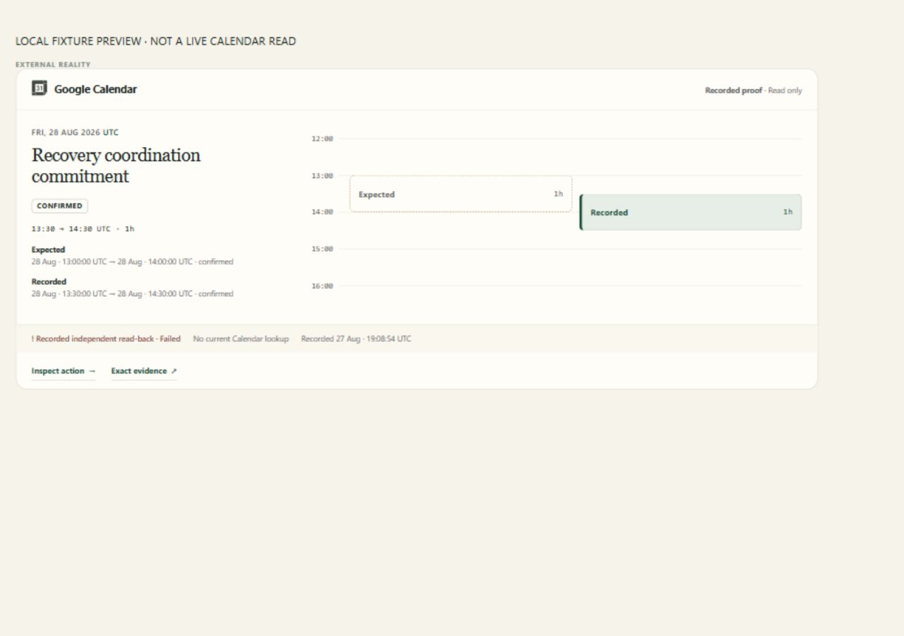
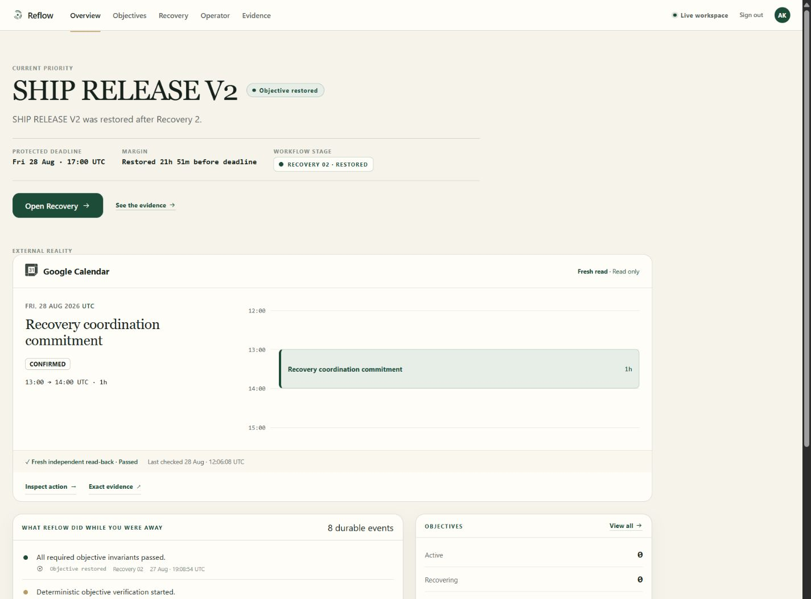
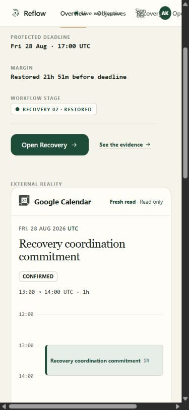
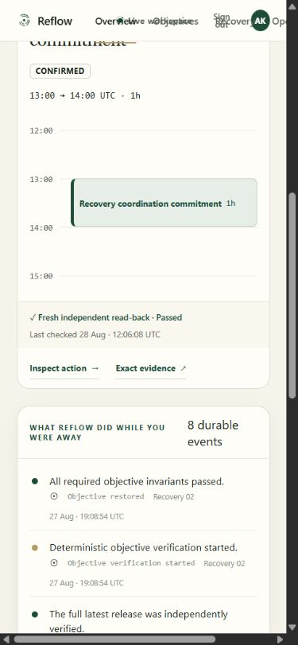

# P2E-B — Live Calendar visualization

Qualification date: 2026-08-28. **LIVE CALENDAR VISUALIZATION GO.**

Frontend source commit: `83c84e90abb34f2f09f23be6349259051f964121`.
Baseline: approved P2E-A `52d654a`, including frozen marketing `24a4219`.
No new branch was created and nothing was pushed to GitHub.

## A. Old Overview Calendar presentation

Overview showed a text-heavy proof card: event times, freshness, comparison,
observation timestamp, and links. It exposed authoritative data but did not
visually communicate a scheduled commitment. See the previous
[authenticated Overview](p2e-a-live-overview.png).

## B. New Calendar visualization

The existing External reality section now contains a compact Calendar surface:
the existing recognizable Calendar mark, a product-safe commitment label, actual
date, current status, start/end and duration, and a sage event block on a vertical
time rail. Warm ivory, forest, sage, and restrained brass reuse app tokens.

Current production data renders **28 August 2026, 13:00–14:00 UTC, Confirmed, 1h**.
The label remains the contract's product-safe “Recovery coordination commitment,”
not an invented external title. Freshness and comparison are immediately visible.
Detailed diagnostics remain in Recovery and Evidence.

## C. Time-axis derivation

Offset-bearing authoritative timestamps are parsed to instants and displayed in
UTC. Missing, malformed, zero-length, or reversed intervals do not draw an event.

The window contains the earliest start through latest end plus padding on both
sides: `min(1 hour, shortest event duration)`. Its bounds are rounded outward to
deterministic readable tick intervals. Position and height are strictly:

```text
top    = (event start - axis start) / axis duration
height = event duration / axis duration
```

For the current one-hour event, the axis is 12:00–15:00 UTC; top and height are each
one third. The measured desktop rail is 208px and event height 69.325px (pixel
rounding). No minimum event height distorts the timestamps. A two-hour event in the
test becomes half of a four-hour axis, not the same fixed rectangle.

Dates are derived, never hardcoded “Today.” Cross-midnight events label their end
date. If a mismatch would reduce either block below 18% of a shared axis, two
explicitly dated, independently bounded rails keep distant dates readable.

## D. Expected/observed behavior

Matching displayed time/status produces one current event. Mismatches use a brass
dashed expected outline and a filled observed event, with explicit Expected and
Observed labels and full textual values. Status-only differences also remain
visible. A backend `FAILED` comparison stays Failed even if displayed timestamps
are equal; the frontend does not calculate a replacement verification verdict.

Missing/current-read failure shows no event, never stale historical geometry
presented as current. Recovery retains the historical proof.



## E. Live freshness treatment

“Fresh read · Read only” requires `READ_BACK` plus `FRESH_READ`. The proof band
renders the supplied comparison result and actual observation timestamp.
Authenticated production displayed **Fresh independent read-back · Passed**,
last checked **28 Aug · 12:06:08 UTC**, under **Live workspace**.

## F. Guest treatment

`NOT_REQUESTED` plus `PERSISTED_READBACK` renders “Recorded proof,” “Recorded
independent read-back,” and “No current Calendar lookup.” The event is labelled
Recorded, not Observed. Guest never receives a fresh/Live label. The frozen
provider, guest export, BFF isolation, and endpoint were not changed. Component
tests cover these labels; the production capture is genuine authenticated Live,
not a guest session substituted as proof.

## G. Responsive/mobile treatment

At 700px and below, summary and vertical rail stack. The rail is 190px high, the
event retains its true one-third span, and the product label remains readable.
The proof band stacks and links wrap. Production DOM measurements:

| Viewport width | Calendar card width | Card scroll width |
| --- | --- | --- |
| 1920 | 1136 | 1134 |
| 1440 | 1136 | 1134 |
| 1280 | 1136 | 1134 |
| 768 | 708.8 | 707 |
| 390 | 331.2 | 330 |

All Calendar cards fit their available width with no internal horizontal
overflow. Desktop uses a 208px rail. The 390px production card is 600.3px high;
its event is 63.325px high on the 190px rail. Local fixture previews were also
visually checked at all five widths, including the mismatch state.

The **existing frozen application navbar overlaps at 390px and contributes to
page-wide horizontal overflow** (document width 481px). This is not a claim of
whole-application mobile qualification. Navbar/workspace layout was explicitly
excluded, so it was not modified. Calendar-local responsive checks pass.

## H. Accessibility

Visible text includes name, dated start/end in UTC, duration, current status,
freshness, comparison, and check time. The event has an accessible name carrying
the same interval/status; decorative grid ticks and duplicate authority mark are
hidden from screen readers. Real dates use `time` elements. Expected/observed
labels and solid/outlined shapes avoid color-only meaning. Links remain native
keyboard-accessible anchors. Tests assert accessible names and truthful status.
This is focused component qualification, not a claim of a full-site WCAG audit.

## I. Data-fetch count before/after

**Before: 1. After: 1** external-reality GET per existing Overview resource load.
The parent still owns `useExternalReality`; the mini-timeline is a pure component
with no fetch, effect, Calendar client, or mutation control. Tests render both
compact and detailed variants and assert exactly one existing provider GET.

Production request logs for the initial 12:06 UTC Overview load corroborate one
BFF GET and its one private-backend GET, both `200`:

- BFF: `12:06:07.953287Z`, latency `0.678765116s`.
- Private backend: `12:06:08.037291Z`, latency `0.589178057s`.

These are the two hops of one read-through, not two independent Calendar reads.
Viewport changes did not reload the resource. Navigating to Recovery uses its
existing separate resource load; no new fetch behavior was introduced.

## J. Tests

- Full frontend: **82 passed, 12 files**, including **21 new timeline tests**.
- Frozen external-reality/BFF regression tests: **40 passed**
  (`uv run pytest -q tests/test_external_reality.py tests/test_p2d_web_bff.py --no-cov`).
- Geometry tests cover canonical and changed duration/position, timezone offsets,
  different dates, cross-midnight, and distant mismatch windows.
- State tests cover Confirmed/Tentative/Cancelled, failed comparisons, recorded
  Guest, three failed lookup statuses, and malformed/missing timing.
- Links, accessible event values, absence of mutation buttons, single GET, and
  unchanged approved contract/provider/backend paths are covered.

Recovery remains Recovery 01 / Act / Actions when opened from Inspect action.
Its existing detailed ladder shows the original acknowledgement, read-back,
verified receipt, and fresh Passed Calendar comparison separately from the
selected recovery's **Failed** objective verification. The exact Evidence URL
retains the existing Calendar receipt identifier without creating a record.
The authenticated production walkthrough followed both links and focused
`calendar:receipt-9899dba7a849a328a49dbd134ac2b35d440284b687f39ca2a349599ad675604c`,
Recovery attempt 1, preserving its original `2026-08-27T19:07:45.772017+00:00`
observation. No historical receipt was relabelled as this new fresh lookup.

## K. Frontend gates

Passed: `npm test`, `npm run typecheck`, `npm run lint`,
`npm run format:check`, `npm run validators:check`, and `npm run build`.
The build also passed contract, eight-fixture, authority-mark, and poster checks.
`git diff --check` passed. The existing large marketing/3D bundle warning remains;
the frozen marketing source/assets were not edited.

## L. Files changed

Source commit (six files):

```text
frontend/src/app/components/CalendarMiniTimeline.tsx
frontend/src/app/components/calendar-mini-timeline.css
frontend/src/app/semantics/calendarTimeline.ts
frontend/src/app/components/CalendarMiniTimeline.test.tsx
frontend/src/app/components/ExternalReality.tsx
frontend/src/app/components/ExternalReality.test.tsx
```

The shared component change is an import and an early return for compact
Overview presentation. Recovery's detailed rendering is otherwise unchanged.

Qualification artifacts: this report, `p2e-b-live-overview.png`,
`p2e-b-live-mobile.png`, `p2e-b-live-mobile-proof.png`,
`p2e-b-local-mobile.png`, and `p2e-b-local-mismatch.png` in `docs/`.
Local fixture-preview files are ignored test aids, not shipped source.

## M. Backend/BFF semantic changes

**NONE.** No Calendar gateway, backend, BFF, Auth, OAuth, IAM, schema, provider,
guest export, receipt, evidence join, incident, objective/recovery semantics,
Gmail, GitHub, agents, Operator, marketing, navbar, or centering change.

Only Firebase Hosting was deployed. Read-only checks confirmed both Cloud Run
services remain at their approved revisions with 100% traffic:

- Private backend: `objective-recovery-00022-pbc`.
- BFF: `reflow-web-bff-00004-6s7`.

Canonical incident `incident-0fc3af5b0bd1ad847aea` remained at revision **16**, with
**28** durable workflow events, before deployment and after production UI reads.
Its SHA-256 remained
`4a1c93385b5b24060c31e995c521455622f1582967c615a2a7a7021e7f13fa8c`.
Fingerprint method is unchanged from P2E-A. No live Calendar mutation was used
for mismatch testing; that screenshot uses an explicitly labelled local fixture.

## N. Production screenshot/deployment

[Live Overview](https://reflow-objective-recovery.web.app/app/overview).

Frontend-only Hosting release: `1787918628804000`.
Version: `86d2153c26cc5732`. Released **2026-08-28T12:03:48.804Z**.
The screenshot below captures the authenticated session and the deployed
Calendar visualization, including the fresh Passed proof. The mobile captures
show the same production observation at two scroll positions.







## O. Commit

Deployed source: `83c84e90abb34f2f09f23be6349259051f964121`,
“Visualize authoritative Calendar commitments on Overview.”
Author and committer: **Amaan Khan <amaank2405@gmail.com>**.
This qualification report/screenshots are recorded in a subsequent documentation
commit on the same pre-existing `codex/ui-m2-orb-anchor-spike` branch.
No new branch, GitHub push, or remote modification was made for P2E-B.

## P. Verdict

**LIVE CALENDAR VISUALIZATION GO.**

The authenticated deployed Overview visibly identifies Google Calendar, a real
scheduled commitment, fresh independent read-back, and a passed current
comparison. Presentation is complete within the specified Calendar-only scope.
The excluded mobile navbar debt is explicitly noted in G, not silently fixed or
included in this verdict. Stop here; no following milestone is started.
